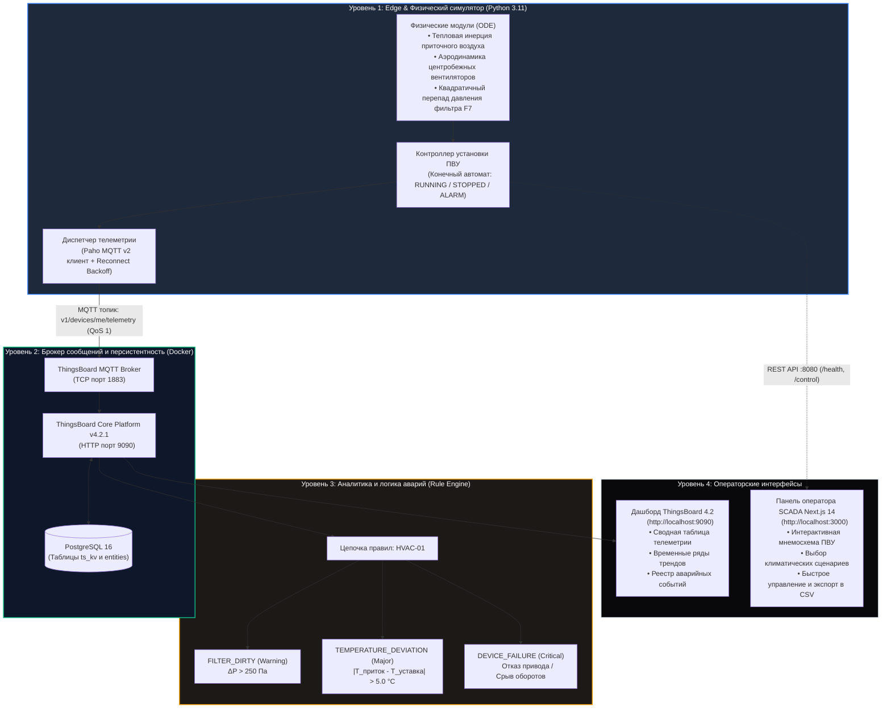

# Промышленная IoT-платформа мониторинга и предиктивной аналитики ПВУ (ThingsBoard CE)

[](https://thingsboard.io/)
[](https://www.postgresql.org/)
[](https://www.python.org/)
[](https://mqtt.org/)
[](https://www.docker.com/)
[-black.svg?logo=next.js)](https://nextjs.org/)
[](https://ui.shadcn.com/)

Production-grade демонстрация инженерного стека IoT-платформы промышленной автоматизации (BMS/HVAC/SCADA) на базе **ThingsBoard Community Edition v4.2.1**, реляционного хранилища **PostgreSQL 16**, физико-математического симулятора оборудования на **Python 3.11** и операторской веб-панели управления на **Next.js 14 / TypeScript**.

---

## Архитектура решения

Решение построено по принципам **Clean Architecture** и стандартам промышленных систем диспетчеризации (BMS/SCADA) с четким разделением уровней сбора, обработки, хранения и визуализации данных.

### 1. Схема взаимодействия компонентов



---

### 2. Сводная таблица архитектурных слоев

| Уровень | Компонент | Назначение | Протоколы и Стек |
| :--- | :--- | :--- | :--- |
| **01. Edge / Моделирование** | `hvac-simulator` | Расчет физических процессов, теплообмена и аэродинамики в реальном времени. | Python 3.11, Pydantic, ODE |
| **02. Транспорт телеметрии** | `ThingsBoardMQTTClient` | Отказоустойчивая доставка телеметрии и атрибутов с экспоненциальным авто-реконнектом. | MQTT v3.1.1 (Paho v2), TCP 1883 |
| **03. Брокер и Core** | `thingsboard-ce` | Маршрутизация пакетов, авторизация по токенам, управление цифровыми двойниками. | ThingsBoard 4.2.1 Community Edition |
| **04. База данных** | `tb-postgres` | Хранение временных рядов телеметрии (`ts_kv`), атрибутов сущностей и журнала событий. | PostgreSQL 16 (Alpine), Docker Volume |
| **05. Обработка событий** | `hvac_rule_chain` | Пороговый анализ параметров, регистрация аварий и автоматическое квитирование. | ThingsBoard Rule Engine |
| **06. SCADA / Диспетчеризация** | `hvac-control-panel` | Автономный веб-пульт оператора с мнемосхемой, климат-профилями и инспектором пакетов. | Next.js 14, React 18, TypeScript, Shadcn UI |

---

### 3. Технологический тракт воздуха (Мнемосхема ПВУ)

Воздушный поток моделируется последовательно через 5 технологических узлов:

```
 Наружный      ┌──────────────┐      ┌──────────────┐      ┌──────────────┐      ┌──────────────┐      ┌──────────────┐     Приточный
  воздух   ──► │ 01. Заслонка │  ──► │ 02. Фильтр   │  ──► │ 03. Водяной  │  ──► │ 04. Водяной  │  ──► │ 05. Вентилятор│ ──►  канал
 (T_outdoor)   │   (0 - 100%) │      │  F7 (ΔP, Па) │      │  охладитель  │      │  калорифер   │      │  (ЧРП, об/м) │    (T_supply)
               └──────────────┘      └──────────────┘      └──────────────┘      └──────────────┘      └──────────────┘
```

---

## Ключевые компоненты

### 1. Физико-математическая модель оборудования (ПВУ)
В отличие от тривиальных рандомайзеров, симулятор моделирует реальные физические процессы вентиляционной установки:
* **Тепловая инерция (ODE):** температура приточного воздуха сходится к уставке с учетом теплоемкости системы и теплопотерь в воздуховоде:
  $$\frac{dT_{supply}}{dt} = \frac{1}{\tau} \cdot (T_{target} - T_{supply}) + \kappa \cdot (T_{outdoor} - T_{supply}) + \xi(t)$$
  где $\tau$ — постоянная тепловой инерции, $\kappa$ — коэффициент теплопередачи через корпус, $\xi(t) \sim \mathcal{N}(0, \sigma^2)$ — высокочастотный сенсорный шум.
* **Аэродинамика и ЧРП:** разгон приточного и вытяжного центробежных вентиляторов по S-образной кривой частотного привода (до 1450 об/мин). Для поддержания положительного подпора воздуха в чистых помещениях вытяжной вентилятор балансируется с дифференциалом $-4\%$.
* **Квадратичный перепад давления ($\Delta P$):** падение давления на карманном фильтре тонкой очистки F7 рассчитывается по аэродинамическому закону:
  $$\Delta P = \Delta P_{clean} \cdot \left(\frac{N}{N_{nom}}\right)^2 \cdot \left(1 + 2.4 \cdot \left(\frac{D}{100}\right)^{1.3}\right)$$
  где $D$ — процент запыленности фильтра, $N$ — текущие обороты крыльчатки.

### 2. Отказоустойчивая доставка телеметрии по MQTT
* **Протокол:** MQTT v3.1.1 (библиотека `paho-mqtt` v2 API).
* **Топик телеметрии:** `v1/devices/me/telemetry` (период публикации: 5 секунд, QoS 1).
* **Топик атрибутов:** `v1/devices/me/attributes` (автоматическая отправка паспортных данных установки при установлении сессии).
* **Отказоустойчивость:** экспоненциальный `reconnect backoff` (1–30 с) при временной недоступности брокера с буферизацией состояния.

### 3. Цепочка правил ThingsBoard (Rule Chain Alarms)
Автоматическое формирование, обновление и квитирование аварийных событий в ThingsBoard Rule Engine:

| Тип аварии | Уровень | Условие срабатывания | Условие снятия (Hysteresis) |
| :--- | :---: | :--- | :--- |
| `FILTER_DIRTY` | **WARNING** | Перепад давления $\Delta P > 250\text{ Па}$ | $\Delta P \le 200\text{ Па}$ после замены фильтра |
| `TEMPERATURE_DEVIATION` | **MAJOR** | $\|T_{приток} - T_{уставка}\| > 5.0^\circ\text{C}$ при работающих вентиляторах | Отклонение $\le 2.5^\circ\text{C}$ (возврат в диапазон) |
| `DEVICE_FAILURE` | **CRITICAL** | Статус `STOPPED` или срыв оборотов вентилятора ($< 100\text{ об/мин}$) в режиме пуска | Восстановление штатных оборотов $> 400\text{ об/мин}$ |

### 4. Два операторских интерфейса

#### А. Нативный дашборд ThingsBoard CE ([http://localhost:9090](http://localhost:9090/dashboards/c33695a0-b29d-11f1-87e7-fbe1daa32f18))
* Построен на виджетах стандарта ThingsBoard 4.x (`system.cards.entities_table`, `system.time_series_chart`, `system.alarm_widgets.alarms_table`).
* Полная локализация на русский язык.
* 5 аналитических зон: сводная таблица оборудования, тренды температур, мониторинг фильтра, аэродинамика вентиляторов и реестр активных аварий.

#### Б. Веб-панель управления Next.js 14 ([http://localhost:3000](http://localhost:3000))
* Современный минималистичный монохромный дизайн (Shadcn/UI, Lucide Icons).
* Интерактивная технологическая мнемосхема ПВУ (воздухозаборная заслонка $\rightarrow$ карманный фильтр F7 $\rightarrow$ охладитель $\rightarrow$ калорифер $\rightarrow$ приточный вентилятор с динамической анимацией вращения).
* Климатические профили для тестирования: **Штатный**, **Лето (Жара)**, **Зима (Мороз)**, **Тест аварии**.
* Слайдер уставки температуры ($16.0 - 30.0^\circ\text{C}$), кнопка аварийного останова (E-STOP) и сброс фильтра.
* Живой инспектор пакетов MQTT, экспорт истории телеметрии в CSV в 1 клик.

---

## Структура репозитория

```
tech-ThingsBoard/
├── .env                              # Активные переменные окружения
├── .env.example                      # Шаблон переменных окружения
├── .gitignore                        # Git-исключения (Python, Node, Docker, IDE)
├── docker-compose.yml                # Сервисы: postgres:16, thingsboard:latest
├── README.md                         # Документация проекта
├── hvac-simulator/                   # Python физический симулятор оборудования
│   ├── Dockerfile                    # Multi-stage Dockerfile симулятора
│   ├── requirements.txt              # Зависимости (paho-mqtt, pydantic-settings)
│   └── src/
│       ├── main.py                   # Точка входа, оркестрация жизненного цикла
│       ├── config.py                 # Pydantic Settings конфигурация
│       ├── server.py                 # HTTP сервер (/health, /telemetry, /control)
│       ├── models/                   # DTO и типизация (state, telemetry, device_info)
│       ├── simulator/                # Физические модули (hvac, temperature, fan, filter, alarms)
│       └── thingsboard/              # Клиент MQTT и диспетчер телеметрии
├── thingsboard/
│   ├── rule_chains/
│   │   └── hvac_rule_chain.json      # Цепочка правил с аварийными триггерами (UTF-8)
│   └── dashboards/
│       └── hvac_dashboard.json       # Конфигурация дашборда ThingsBoard 4.x (UTF-8)
├── scripts/
│   ├── provision_thingsboard.py      # Автоматический скрипт инициализации сущностей через REST API
│   └── rebuild_dashboard.py          # Скрипт сборки и обновления дашборда
└── hvac-control-panel/               # Панель оператора Next.js 14 / TypeScript / Shadcn
    ├── package.json
    ├── app/
    │   ├── page.tsx                  # Главный SCADA интерфейс на русском языке
    │   ├── layout.tsx                # Корневой layout и метаданные
    │   └── globals.css               # Монохромная тема и анимации
    └── tsconfig.json
```

---

## Быстрый старт (Quickstart)

### Требования
* ОС: Windows / Linux / macOS
* Docker Desktop (с поддержкой Compose v2)
* Python 3.10+
* Node.js 18+ и npm

---

### Шаг 1. Клонирование и переменные окружения
```bash
cp .env.example .env
```

Параметры по умолчанию в `.env`:
* ThingsBoard Web UI: `http://localhost:9090`
* ThingsBoard MQTT Broker: `localhost:1883`
* Учетная запись: `tenant@thingsboard.org` / `tenant`
* Токен доступа оборудования: `HVAC_VENT_SECRET_TOKEN`
* HTTP API симулятора: `http://localhost:8080`
* Порт панели оператора: `http://localhost:3000`

---

### Шаг 2. Запуск инфраструктуры (Docker)
```bash
docker compose up -d
```
Запускаются контейнеры:
* `tb-postgres` (`postgres:16-alpine`) — СУБД с сохранением данных в volume `tb-postgres-data`.
* `thingsboard-ce` (`thingsboard/tb-postgres:latest`) — ядро ThingsBoard и брокер MQTT.

> **Важно:** При первом запуске ThingsBoard выполняет миграции схемы базы данных (около 35–45 секунд).  
> Проверить готовность можно командой:
> ```bash
> docker compose logs -f thingsboard
> ```
> Когда появится строка `ThingsBoard started in ... ms`, система готова к работе.

---

### Шаг 3. Автоматическая настройка (Provisioning в 1 команду)
Запустите скрипт автоматической настройки через REST API ThingsBoard:
```bash
python scripts/provision_thingsboard.py
```
Скрипт автоматически:
1. Авторизуется под администратором тенанта (`tenant@thingsboard.org`).
2. Создает устройство **HVAC-01** и привязывает access token `HVAC_VENT_SECRET_TOKEN`.
3. Записывает паспорта и серверные метаданные оборудования (`ORIONMETER`, `HVAC-VENT-001`).
4. Импортирует и компилирует цепочку правил **«HVAC-01: Мониторинг и аварии (ПВУ)»**.
5. Импортирует и публикует дашборд **«Промышленный мониторинг ПВУ (HVAC)»**.

---

### Шаг 4. Запуск симулятора оборудования
Симулятор запускается локально или через Docker:

**Вариант A (Локально через Python):**
```bash
pip install -r hvac-simulator/requirements.txt
python hvac-simulator/src/main.py
```

**Вариант B (Через Docker):**
```bash
docker compose --profile simulator up -d hvac-simulator
```

После запуска в консоли каждые 5 секунд логируются отправленные в MQTT пакеты:
```
[OK] SENT | State=RUNNING | T_sup= 21.4 C (T_tgt=21.5 C, T_out= 15.0 C) | Fans=1235/1182 RPM | Filter= 76.1 Pa ( 9.0%) | Valves(H/C)=20.0%/ 0.0%
```

---

### Шаг 5. Запуск операторской веб-панели (Next.js)
В отдельном окне терминала:
```bash
cd hvac-control-panel
npm install
npm start
```
*(или `npm run dev` для режима разработки)*.

Откройте в браузере: **[http://localhost:3000](http://localhost:3000)**.

---

## Спецификация телеметрии и API

### 1. Формат телеметрии (MQTT топик `v1/devices/me/telemetry`)
```json
{
  "timestamp": 1789653612506,
  "supply_temperature": 21.1,
  "outdoor_temperature": 15.0,
  "target_temperature": 21.5,
  "humidity": 43.8,
  "supply_fan_rpm": 1235,
  "exhaust_fan_rpm": 1182,
  "filter_pressure": 76.1,
  "filter_dirty_percent": 9.0,
  "damper_position": 76.0,
  "heating_valve": 20.0,
  "cooling_valve": 0.0,
  "status": "RUNNING"
}
```

### 2. Серверные и клиентские атрибуты (`v1/devices/me/attributes`)
```json
{
  "manufacturer": "ORIONMETER",
  "model": "HVAC-VENT-001",
  "rated_airflow_m3h": 3500,
  "location": "Main Facility - Building A, Roof",
  "firmware_version": "1.2.0-prod"
}
```

### 3. Встроенный REST API симулятора (`http://localhost:8080`)
* `GET /health` — статус работы сервиса и подключение к MQTT:
  ```json
  {
    "status": "UP",
    "mqtt_connected": true,
    "hvac_status": "RUNNING",
    "mode": "NORMAL",
    "running": true
  }
  ```
* `GET /telemetry` — моментальный снимок последних физических параметров.
* `POST /control` — удаленная диспетчеризация симулятора:
  ```bash
  curl -X POST http://localhost:8080/control \
    -H "Content-Type: application/json" \
    -d '{"mode": "SUMMER", "target_temperature": 22.0}'
  ```

---

## Сводная таблица учетных записей и портов

| Сервис | Адрес | Логин / Токен | Пароль |
| :--- | :--- | :--- | :--- |
| **Панель оператора SCADA** | `http://localhost:3000` | — | — |
| **ThingsBoard Web UI** | `http://localhost:9090` | `tenant@thingsboard.org` | `tenant` |
| **ThingsBoard SysAdmin** | `http://localhost:9090` | `sysadmin@thingsboard.org` | `sysadmin` |
| **MQTT Broker** | `localhost:1883` | Токен: `HVAC_VENT_SECRET_TOKEN` | — |
| **PostgreSQL 16** | `localhost:5432` | `postgres` | `postgres` |
| **HTTP API симулятора** | `http://localhost:8080` | — | — |

---

## Инженерные решения и масштабируемость

1. **Идемпотентность и автоматизация (IaC):** Все скрипты инициализации (`provision_thingsboard.py`, `rebuild_dashboard.py`) строго идемпотентны. Повторный запуск не создает дубликатов устройств, дашбордов или правил.
2. **Персистентность данных:** База данных PostgreSQL и служебные логи хранятся в именованных томах Docker (`tb-postgres-data`, `tb-data`, `tb-logs`), что защищает историю телеметрии и дашбордов от потери при перезапуске контейнеров.
3. **Совместимость с ThingsBoard 4.x:** Виджеты дашборда полностью соответствуют дескрипторам схем ThingsBoard 4.2.x с корректными FQN-типами, настройками таблиц и источников аварийных событий.
4. **Чистый код:** Код проекта самодокументирован, разделен по слоям ответственности, избавлен от загромождающих комментариев и использует строгую статическую типизацию (Pydantic / TypeScript).
