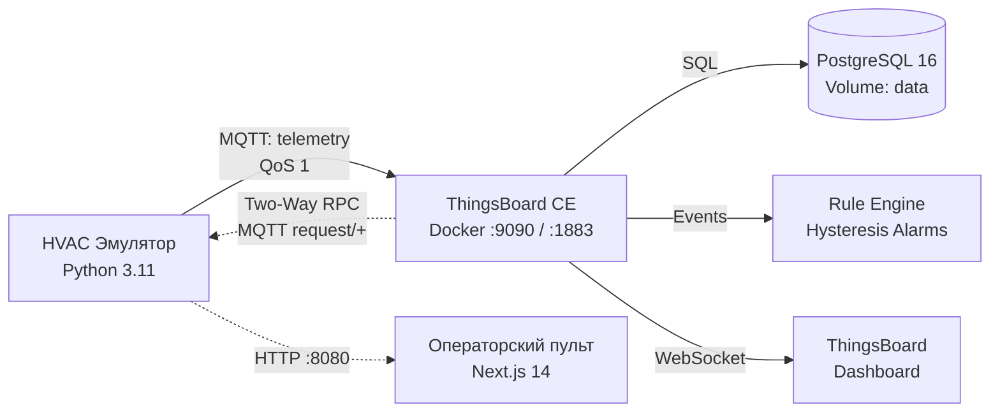
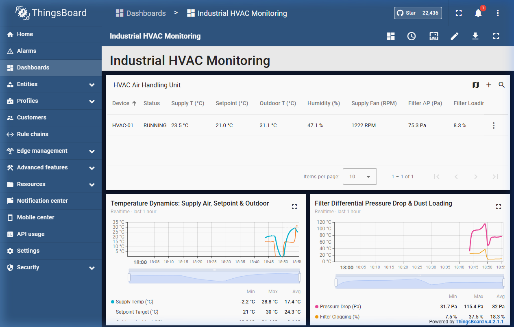
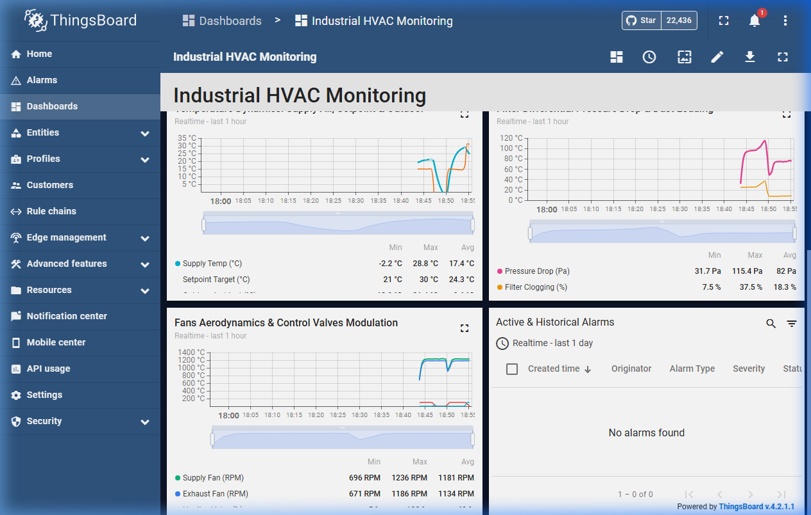
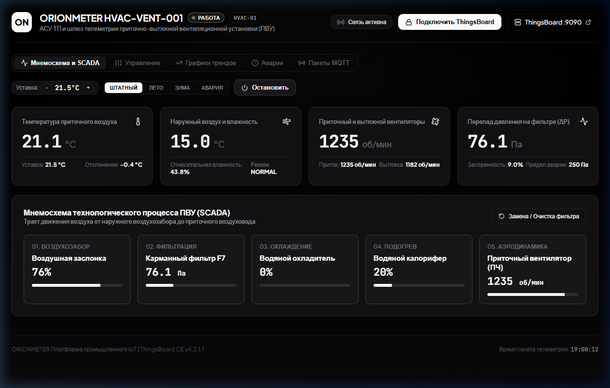

# Мониторинг приточно-вытяжной установки (HVAC) в ThingsBoard CE

Проект сделан в рамках тестового задания на позицию **Инженер IoT-платформы ThingsBoard (Dashboard-as-Code)**.

Здесь собран полный цикл работы IoT-устройства: эмулятор вентиляционной установки (ПВУ) на Python генерирует физически правдоподобную телеметрию, шлет её по MQTT в локальный ThingsBoard CE, где данные обрабатываются правилами Rule Engine, складываются в PostgreSQL и отображаются на интерактивном дашборде. Также настроено двустороннее управление (RPC) обратно на устройство.

---

## Архитектура проекта

Схема движения данных предельно простая и стандартная для IoT:



1. **Эмулятор оборудования (`hvac-simulator`):** крутится в фоне, каждые 5 секунд считает физику воздуха, вентиляторов и фильтра, отправляет телеметрию в топик `v1/devices/me/telemetry` и слушает команды управления.
2. **ThingsBoard CE + PostgreSQL (`docker-compose.yml`):** принимает данные по MQTT, хранит историю в базе с сохранением данных на диске, проверяет аварии.
3. **Цепочка правил (`hvac_rule_chain.json`):** следит за перепадом давления на фильтре и отклонением температуры, автоматически создавая и закрывая аварии.
4. **Дашборд (`hvac_dashboard.json`):** выводит текущее состояние, графики истории и таблицу тревог.
5. **Скрипт автоматизации (`provision_thingsboard.py`):** сам создает устройство, токены, импортирует правила и дашборд через REST API без ручных кликов в браузере.

---

## Что я реализовал

- **Docker-окружение:** поднял ThingsBoard CE 4.x в связке с PostgreSQL 16 через `docker-compose`. Данные БД вынесены в named volume `tb-postgres-data`, настроен healthcheck на готовность базы и restart policy `unless-stopped`.
- **Эмулятор ПВУ с физической моделью:**
  - Температура притока плавно сходится к уставке с учетом тепловой инерции воздуховода и уличной температуры, а не скачет случайными числами.
  - Обороты вентиляторов разгоняются по плавной кривой (до 1450 об/мин), вытяжка балансируется с небольшим дифференциалом для поддержания подпора воздуха.
  - Мощность вентиляторов рассчитывается по кубическому закону от скорости ($P \propto N^3$), считается суммарный расход в кВт·ч и тепловой коэффициент COP.
  - Фильтр F7 постепенно забивается от прокачанного объема воздуха: растет перепад давления $\Delta P$ и считается расчетный остаточный ресурс до замены (RUL).
- **Двустороннее управление (Two-Way RPC):**
  - Поддержал топики `v1/devices/me/rpc/request/+` и ответы в `v1/devices/me/rpc/response/+`.
  - С дашборда или через API можно на лету менять уставку температуры (`setTargetTemperature`), останавливать/запускать установку (`setPower`), переключать режимы (`setMode`) и сбрасывать счетчик после замены фильтра (`resetFilter`).
- **Обработка аварий в Rule Engine:**
  - Настроил полноценный гистерезис: авария фильтра загорается при перепаде $> 250\text{ Па}$, а снимается только при опускании ниже $200\text{ Па}$. Это убирает дребезг тревог на границе порога.
  - Авария отклонения температуры срабатывает при рассогласовании $> 5^\circ\text{C}$ и снимается при возврате в окно $2.5^\circ\text{C}$.
- **Dashboard-as-Code:** написал скрипт инициализации на Python, который через REST API платформы полностью настраивает стенд «с нуля» за одну команду.
- **Операторский веб-пульт:** дополнительно собрал легковесную панель на Next.js с интерактивной мнемосхемой установки, ручным управлением уставками и прямым вызовом RPC.

---

## Скриншоты

### 1. Основной дашборд ThingsBoard
Сводная таблица параметров установки: текущие статусы, температуры, обороты вентиляторов, перепад на фильтре и энергопотребление.



---

### 2. Графики телеметрии и история параметров
Динамика температур (приток, уставка, улица), рост перепада давления на фильтре и работа регулирующих клапанов во времени.



---

### 3. Обработка аварий в Rule Engine
Срабатывание тревоги `FILTER_DIRTY` при превышении порога в 250 Па с отображением деталей аварии и времени фиксации.


---

### 4. Операторский пульт и мнемосхема
Мнемосхема технологического тракта воздуха (заслонка $\rightarrow$ фильтр $\rightarrow$ теплообменники $\rightarrow$ вентиляторы) и кнопки вызова RPC-команд.



---

## Технический стек

- **IoT-платформа:** ThingsBoard Community Edition 4.x
- **База данных:** PostgreSQL 16 (Alpine)
- **Эмулятор:** Python 3.11, `paho-mqtt` v2, `pydantic-settings`, `requests`
- **Инфраструктура:** Docker Compose v2
- **Интерфейс оператора:** Next.js 14, React 18, TypeScript, Tailwind CSS

---

## Быстрый запуск

### 1. Клонирование и переменные окружения
```bash
git clone https://github.com/Omarigato/tech-ThingsBoard.git
cd tech-ThingsBoard
cp .env.example .env
```

### 2. Запуск контейнеров ThingsBoard и PostgreSQL
```bash
docker compose up -d
```
> **Важно:** При первом старте ThingsBoard накатывает начальные схемы в базу данных. Это занимает около 30–45 секунд. Проверить готовность можно логом:
> ```bash
> docker compose logs -f thingsboard
> ```
> Дождитесь строки `ThingsBoard started in ... ms`.

### 3. Автоматическая настройка платформы (Provisioning)
Скрипт создаст устройство `HVAC-01`, токен доступа, цепочку правил и дашборд:
```bash
python scripts/provision_thingsboard.py
```

### 4. Запуск эмулятора оборудования
```bash
pip install -r hvac-simulator/requirements.txt
python hvac-simulator/src/main.py
```
Эмулятор подключится к брокеру `localhost:1883` и начнет отдавать пакеты:
```
[OK] SENT | State=RUNNING | T_sup= 21.5 C (T_tgt=21.5 C, T_out= 15.0 C) | Fans=1240/1180 RPM | Filter= 96.5 Pa (25.5%) | P=2.48kW (COP=2.6) | Health=100.0%
```

### 5. Просмотр результатов
- **Дашборд ThingsBoard:** [http://localhost:9090](http://localhost:9090)  
  *(Логин: `tenant@thingsboard.org`, Пароль: `tenant`)*
- **Операторский пульт (опционально):** [http://localhost:3000](http://localhost:3000)  
  *(Запуск: `cd hvac-control-panel && npm install && npm start`)*

---

## Формат телеметрии по MQTT

Телеметрия публикуется в топик `v1/devices/me/telemetry` каждые 5 секунд с QoS 1:

```json
{
  "timestamp": 1789705315394,
  "supply_temperature": 21.5,
  "outdoor_temperature": 15.2,
  "target_temperature": 21.5,
  "humidity": 50.2,
  "supply_fan_rpm": 1242,
  "exhaust_fan_rpm": 1174,
  "filter_pressure": 96.7,
  "filter_dirty_percent": 25.9,
  "damper_position": 79.0,
  "heating_valve": 15.7,
  "cooling_valve": 0.0,
  "status": "RUNNING",
  "instant_power_kw": 2.49,
  "total_energy_kwh": 143.04,
  "cop_efficiency": 2.56,
  "filter_rul_hours": 425.8,
  "health_index": 100.0,
  "bearing_vibration": 1.42
}
```

Статические паспорта установки отправляются один раз при подключении в топик `v1/devices/me/attributes`:
```json
{
  "manufacturer": "ORIONMETER",
  "model": "HVAC-VENT-001",
  "serial_number": "ONM-2026-HVAC-01",
  "rated_airflow_m3h": 3500,
  "filter_type": "Pocket Filter F7 (ePM1 70%)",
  "firmware_version": "v1.2.0-prod"
}
```

---

## Технические решения (Technical decisions)

- **Почему MQTT, а не HTTP?**  
  Для постоянного потока телеметрии HTTP неэффективен: на каждые 100 байт данных приходится 500+ байт заголовков и накладные расходы на TCP handshake. MQTT держит постоянное легкое соединение, шлет минимальный заголовок (2 байта) и поддерживает постоянный канал для двустороннего RPC управления без белого IP на контроллере.
- **Почему простая физическая модель вместо `random.uniform()`?**  
  Случайные скачки ломают саму идею мониторинга. Реальный воздух прогревается постепенно из-за теплоемкости, вентилятор разгоняется плавно, а фильтр засоряется пропорционально расходу воздуха. Модель на базовых дифференциальных уравнениях позволяет проверять реакцию регуляторов и цепочек правил в реальных условиях.
- **Зачем нужен гистерезис для аварий?**  
  Если давление колеблется около границы 250 Па (например, 249–251 Па), без гистерезиса система будет открывать и закрывать по 20 аварий в минуту (*Alarm Flapping*). Гистерезис (включение $> 250\text{ Па}$, отключение $\le 200\text{ Па}$) защищает журнал оператора от мусора.
- **Почему автоматизация через REST API (Dashboard-as-Code)?**  
  В ThingsBoard дашборды жестко привязаны к внутренним UUID устройств. При ручном экспорте/импорте JSON на чистый инстанс дашборд теряет связь с сущностями. Скрипт `provision_thingsboard.py` динамически находит актуальный UUID по стабильному имени `HVAC-01` и связывает все виджеты автоматически.

---

## Что можно улучшить (Possible improvements)

Если развивать проект дальше в сторону полноценного продакшна:
1. **Безопасность устройств:** заменить простой статический токен на аутентификацию по X.509 клиентским сертификатам (mTLS).
2. **Масштабирование хранилища:** для потока сотен устройств заменить PostgreSQL на TimescaleDB с автоматическим партиционированием по времени или Cassandra.
3. **Очередь сообщений:** при росте нагрузки заменить встроенную `in-memory` очередь ThingsBoard на внешний кластер Apache Kafka.
4. **Тестирование:** покрыть unit-тестами сходимость тепловой модели и обработку граничных значений в `pytest`.
5. **CI/CD:** добавить GitHub Actions pipeline для проверки линтинга, типов (mypy) и автоматической сборки Docker-образов.

---

## Частые проблемы при запуске (Troubleshooting)

- **`Connection refused` на порту 1883 или 9090:** ThingsBoard еще не закончил стартовую инициализацию базы данных. Проверьте лог: `docker compose logs -f thingsboard`.
- **Заняты порты 5432 или 9090:** Если на машине уже крутится локальный Postgres, измените порт в `.env` (например, `POSTGRES_PORT=5433`).
- **Сброс данных:** Чтобы полностью очистить стенд и пересоздать базу с нуля:
  ```bash
  docker compose down -v
  docker compose up -d
  ```
